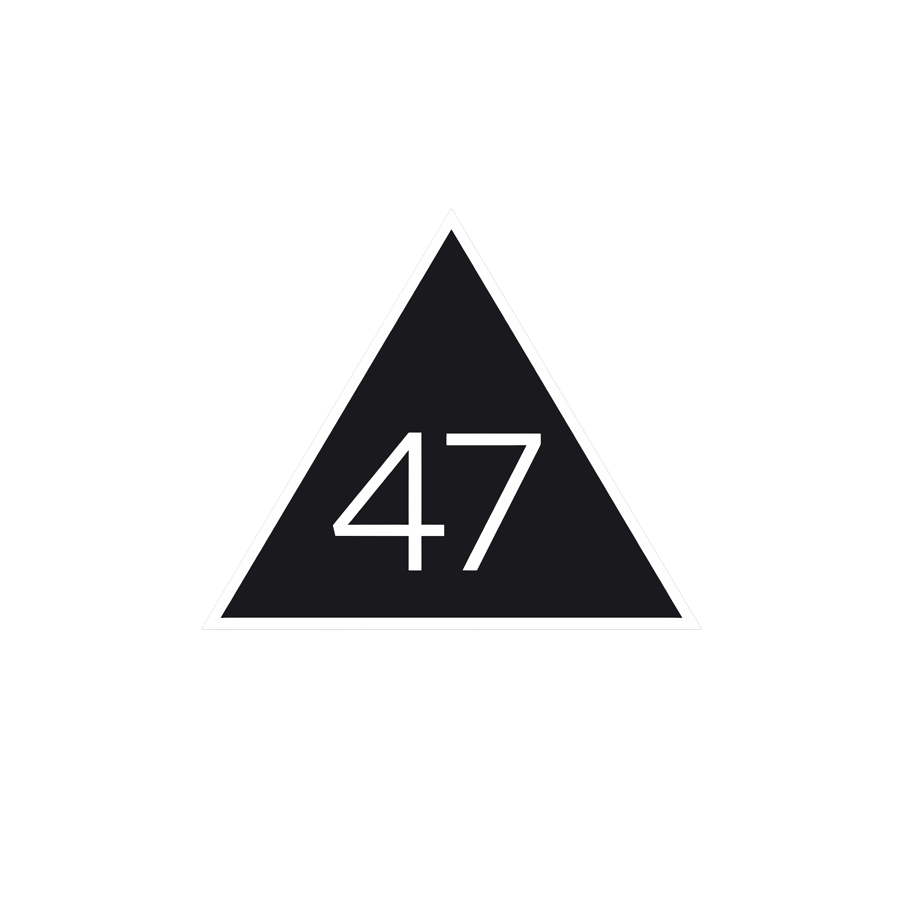

<p align="center">
  <a href="https://akilluminati47.github.io/lightmode/"></a>
</p>

<p align="center">
  <a href="https://akilluminati47.github.io/lightmode/"></a>
</p>

<div align="center">


</div>

<p align="center"><a href="https://akilluminati47.pages.dev"></a> <a href="https://github.com/akilluminati47"></a></p>

---

<p align="center">
  <a href="https://guns.lol/akilluminati47">
    
  </a>
</p>

## About

<p align="center">
  <i>welcome to my canvas.</i>
</p>

<p align="center">
  <a href="https://akilluminati47.pages.dev">
    
  </a>
</p>

> **Strengths**  &middot;  taste  &middot;  ethics  &middot;  results

---

## Tech Stack

<p align="center">
  <a href="https://www.python.org/"></a>
  <a href="https://developer.mozilla.org/en-US/docs/Web/JavaScript"></a>
  <a href="https://www.typescriptlang.org/"></a>
  <a href="https://www.rust-lang.org/"></a>
  <a href="https://isocpp.org/"></a>
  <a href="https://dotnet.microsoft.com/en-us/languages/csharp"></a>
  <a href="https://dart.dev/"></a>
</p>
<p align="center">
  <a href="https://react.dev/"></a>
  <a href="https://nextjs.org/"></a>
  <a href="https://flutter.dev/"></a>
  <a href="https://developer.mozilla.org/en-US/docs/Web/HTML"></a>
  <a href="https://developer.mozilla.org/en-US/docs/Web/CSS"></a>
  <a href="https://tailwindcss.com/"></a>
</p>
<p align="center">
  <a href="https://www.djangoproject.com/"></a>
  <a href="https://fastapi.tiangolo.com/"></a>
  <a href="https://nodejs.org/"></a>
  <a href="https://expressjs.com/"></a>
  <a href="https://www.postgresql.org/"></a>
  <a href="https://www.mongodb.com/"></a>
  <a href="https://redis.io/"></a>
  <a href="https://firebase.google.com/"></a>
</p>
<p align="center">
  <a href="https://www.docker.com/"></a>
  <a href="https://git-scm.com/"></a>
  <a href="https://github.com/features/actions"></a>
  <a href="https://www.linux.org/"></a>
  <a href="https://www.gnu.org/software/bash/"></a>
  <a href="https://code.visualstudio.com/"></a>
</p>

## Toolbox

<p align="center">

<!-- Anthropic Claude -->
<a href="https://www.anthropic.com/claude"></a>
<a href="https://www.anthropic.com/claude"></a>
<a href="https://www.anthropic.com/claude"></a>

<br>

<!-- Frontier Models -->
<a href="https://gemini.google.com/"></a>
<a href="https://www.deepseek.com/"></a>
<a href="https://kimi.moonshot.cn/"></a>
<a href="https://chat.qwenlm.ai/"></a>

<br>

<!-- AI Infra & Cloud -->
<a href="https://fireworks.ai/"></a>
<a href="https://www.cloudflare.com/"></a>
<a href="https://workers.cloudflare.com/"></a>

<br>

<!-- Coding Agents -->
<a href="https://www.anthropic.com/claude-code"></a>
<a href="https://opencode.ai/"></a>
<a href="https://openrouter.ai/"></a>

</p>

---

## Services and Brands

<p align="center">

<!-- Dev & Web -->
<a href="https://github.com/"></a>
<a href="https://github.com/sponsors"></a>
<a href="https://github.com/features/actions"></a>
<a href="https://pages.github.com/"></a>
<a href="https://git-scm.com/"></a>
<a href="https://react.dev/"></a>
<a href="https://developer.mozilla.org/en-US/docs/Web/JavaScript"></a>
<a href="https://www.khronos.org/webgl/"></a>
<a href="https://www.w3.org/TR/webgpu/"></a>
<a href="https://railway.app/"></a>
<a href="https://notepad-plus-plus.org/"></a>
<a href="https://www.gimp.org/"></a>
<a href="https://www.electron.build/"></a>
<a href="https://dotnet.microsoft.com/"></a>
<a href="https://www.lua.org/"></a>
<a href="https://www.7-zip.org/"></a>
<a href="https://fonts.google.com/"></a>
<a href="https://yaml.org/"></a>
<a href="https://midi.org/"></a>
<a href="https://en.wikipedia.org/wiki/RSS"></a>
<a href="https://www.bluetooth.com/"></a>
<a href="https://www.anthropic.com/"></a>
<a href="https://kimi.moonshot.cn/"></a>
<a href="https://resend.com/"></a>
<a href="https://gravatar.com/"></a>
<a href="https://www.malwarebytes.com/"></a>
<a href="https://godotengine.org/"></a>
<a href="https://unity.com/"></a>
<a href="https://steamdb.info/"></a>
<a href="https://www.igdb.com/"></a>
<a href="https://dolphin-emu.org/"></a>
<a href="https://obsproject.com/"></a>
<a href="https://www.qbittorrent.org/"></a>

<br>

<!-- Gaming & Entertainment -->
<a href="https://www.sony.com/"></a>
<a href="https://www.playstation.com/"></a>
<a href="https://www.sega.com/"></a>
<a href="https://atari.com/"></a>
<a href="https://www.rockstargames.com/"></a>
<a href="https://www.ubisoft.com/"></a>
<a href="https://www.valvesoftware.com/"></a>
<a href="https://www.ea.com/"></a>
<a href="https://www.activision.com/"></a>
<a href="https://2k.com/"></a>
<a href="https://www.square-enix.com/"></a>
<a href="https://store.steampowered.com/"></a>
<a href="https://www.epicgames.com/"></a>
<a href="https://www.fortnite.com/"></a>
<a href="https://www.gog.com/"></a>
<a href="https://www.twitch.tv/"></a>
<a href="https://www.dell.com/en-us/shop/gaming-pcs/sf/alienware"></a>
<a href="https://www.hp.com/"></a>
<a href="https://www.nba.com/"></a>
<a href="https://www.ufc.com/"></a>
<a href="https://www.mlb.com/"></a>
<a href="https://www.chess.com/"></a>

<br>

<!-- Audio & Streaming -->
<a href="https://www.pandora.com/"></a>
<a href="https://www.spotify.com/"></a>
<a href="https://soundcloud.com/"></a>
<a href="https://tidal.com/"></a>
<a href="https://www.youtube.com/"></a>
<a href="https://www.dts.com/"></a>
<a href="https://www.dolby.com/"></a>
<a href="https://www.beatsbydre.com/"></a>
<a href="https://streamlabs.com/"></a>
<a href="https://www.guitar-pro.com/"></a>
<a href="https://www.paramountplus.com/"></a>
<a href="https://www.bandsintown.com/"></a>

<br>

<!-- Automotive & Lifestyle -->
<a href="https://www.porsche.com/"></a>
<a href="https://www.hyundai.com/"></a>
<a href="https://www.mitsubishi.com/"></a>
<a href="https://www.lamborghini.com/"></a>
<a href="https://www.rolls-roycemotorcars.com/"></a>
<a href="https://www.mercedes-amg.com/"></a>
<a href="https://www.ramtrucks.com/"></a>
<a href="https://www.astonmartin.com/"></a>
<a href="https://www.nike.com/"></a>
<a href="https://www.nike.com/jordan"></a>
<a href="https://www.adidas.com/"></a>
<a href="https://www.reebok.com/"></a>
<a href="https://www.virgin.com/"></a>
<a href="https://www.uber.com/"></a>
<a href="https://www.nasa.gov/"></a>

<br>

<!-- Food & Commerce -->
<a href="https://www.bk.com/"></a>
<a href="https://www.mcdonalds.com/"></a>
<a href="https://www.kfc.com/"></a>
<a href="https://www.tacobell.com/"></a>
<a href="https://www.coca-cola.com/"></a>
<a href="https://www.starbucks.com/"></a>
<a href="https://www.redbull.com/"></a>
<a href="https://www.newegg.com/"></a>
<a href="https://www.aliexpress.com/"></a>
<a href="https://www.ebay.com/"></a>
<a href="https://www.fedex.com/"></a>
<a href="https://www.marriott.com/"></a>

<br>

<!-- Big Tech Software & Tools -->
<a href="https://www.nvidia.com/"></a>
<a href="https://www.amd.com/"></a>
<a href="https://www.intel.com/"></a>
<a href="https://www.android.com/"></a>
<a href="https://www.samsung.com/"></a>
<a href="https://www.motorola.com/"></a>
<a href="https://www.google.com/"></a>
<a href="https://www.apple.com/"></a>
<a href="https://www.facebook.com/"></a>
<a href="https://about.meta.com/"></a>
<a href="https://discord.com/"></a>
<a href="https://www.reddit.com/"></a>
<a href="https://www.snapchat.com/"></a>
<a href="https://www.instagram.com/"></a>
<a href="https://ring.com/"></a>
<a href="https://www.wikipedia.org/"></a>
<a href="https://www.ted.com/"></a>
<a href="https://www.zellepay.com/"></a>
<a href="https://www.paypal.com/"></a>
<a href="https://stripe.com/"></a>
<a href="https://cash.app/"></a>
<a href="https://venmo.com/"></a>
<a href="https://robinhood.com/"></a>
<a href="https://www.roku.com/"></a>
<a href="https://archive.org/"></a>

</p>

---

## GitHub Analytics

<p align="center">
  <a href="https://akilluminati47.github.io/lightmode/"></a>
</p>

<p align="center">
  
</p>

---

## Current Focus

```yaml
akilluminati47:
  brewing:
    - design innovations
    - modern user interfaces
    - gaming experiences
  building:
    - personal sites & tools
    - experimental projects
    - competitive teams
  exploring:
    - databases & library searches
    - LLM application architecture
    - systems programming
  vibing_to:
    - homebrew games
    - 24/7 beverages
  open_to:
    - cool collaborations
    - freelance gigs
```
<div align="center">


</div>

---

<p align="center">
  <i>thank you, take care.</i>
</p>

<p align="center">
  <a href="https://akilluminati47.github.io/lightmode/"></a>
</p>
